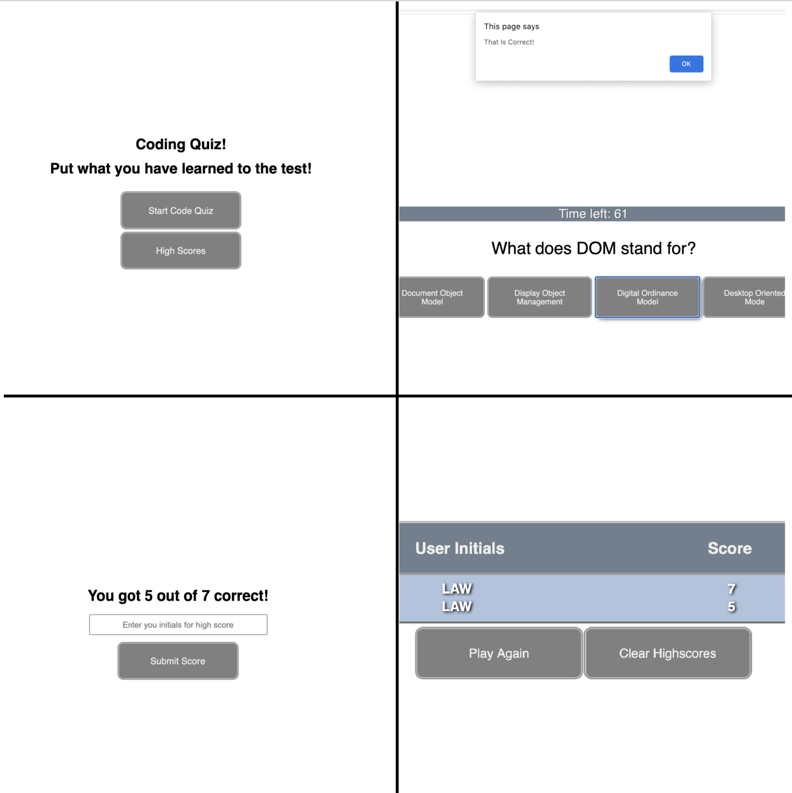

When the user clicks the "start quiz" button a timer begins and the first question appears.
After each question is answered an alert allows the user to know if they answered correctly.
The timer ends when the user answers the last question. 
After the last question the user is given their score and the opportunity to save their name and score.

Added comments to aid in future editing of the site.
No console errors shown.
HTML ran through W3 Validator with no errors or warnings.

